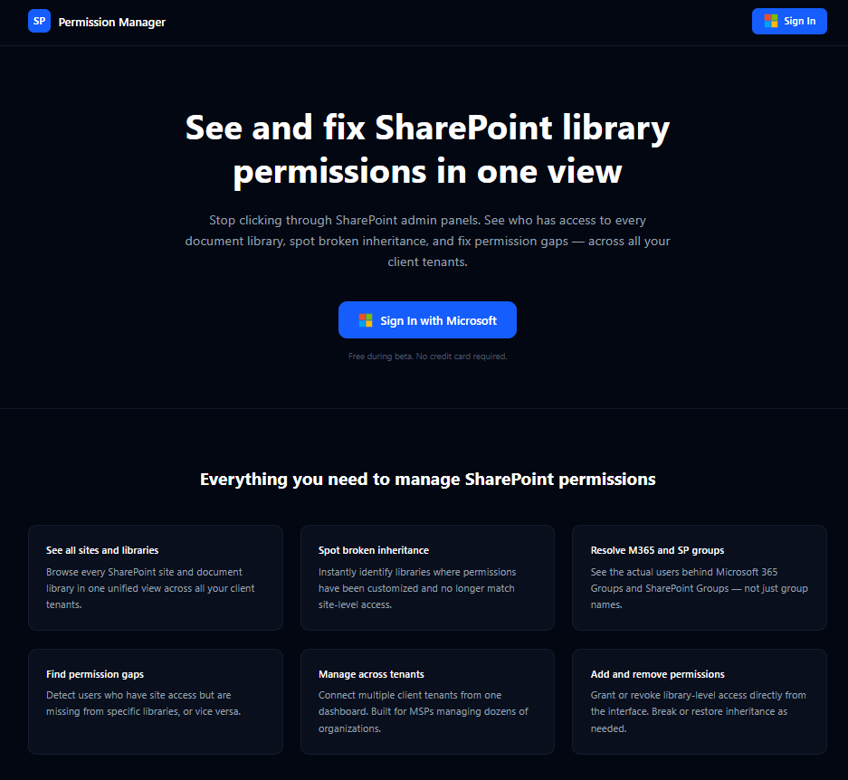
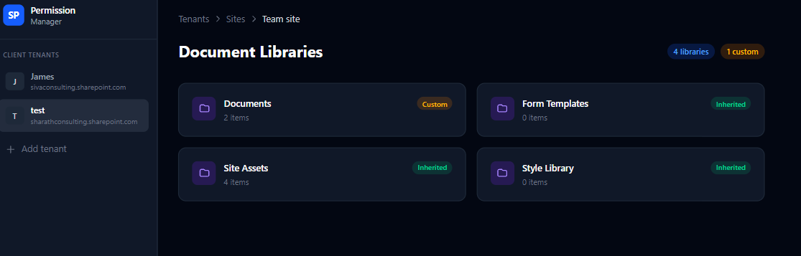
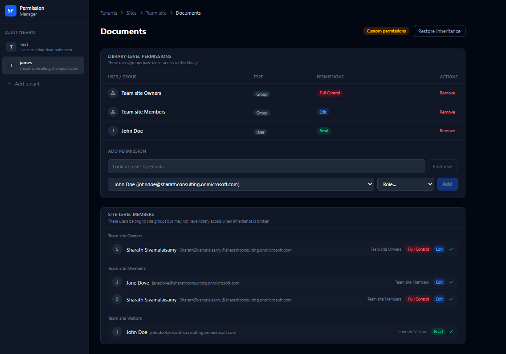

# SharePoint Permission Manager

A self-hosted GUI for viewing and managing SharePoint site permissions. Built for IT admins who find the SharePoint admin center painful to navigate.



---

## The problem it solves

SharePoint's permission model is layered: a user can be granted access via an M365 Group, a SharePoint Group, or a direct role assignment — and all three can coexist on the same site. The native admin center shows you a flat list that doesn't distinguish between these sources. When someone reports they "can't access" a site, you end up clicking through 4–5 screens to figure out why.

This tool shows you everything in one view: who has access, through which mechanism, and at what permission level.




---

## Why SharePoint REST API (not just Graph)

The Microsoft Graph API (`/sites/{id}/permissions`) is the obvious choice, but it's incomplete for this use case. Graph returns high-level sharing links and app grants — it doesn't expose SharePoint's internal role assignment model (Full Control, Contribute, Read, custom levels, broken inheritance).

To get the full picture you need the SharePoint REST API:

```
GET https://{domain}/sites/{site}/_api/web/roleassignments?$expand=Member,RoleDefinitionBindings
```

This returns the actual SharePoint permission inheritance tree, including:
- Broken inheritance at list/library level
- Custom permission levels
- SharePoint Groups with their members
- Direct user assignments

The app uses **both APIs**: Graph for M365 Group membership and user lookups, SharePoint REST for the actual permission model.

---

## Tech stack

| Layer | Technology |
|-------|-----------|
| Backend | FastAPI + Uvicorn |
| Auth | MSAL (Microsoft Authentication Library) — delegated OAuth |
| SharePoint | SharePoint REST API (`/_api/web/roleassignments`) |
| User/Group data | Microsoft Graph API |
| Frontend | React 18 + Vite + Tailwind CSS |
| Session | Starlette encrypted cookie sessions |

---

## Quick start (self-host)

### Prerequisites
- Python 3.11+
- Node 18+
- An Azure AD app registration (see below)

### 1. Azure AD app registration

1. [portal.azure.com](https://portal.azure.com) → Azure Active Directory → App registrations → **New registration**
2. Redirect URI: `http://localhost:8000/api/auth/callback`
3. API permissions → Add:
   - Microsoft Graph: `Sites.Read.All`, `Group.Read.All`, `User.Read` (delegated)
   - SharePoint: `AllSites.Read` (delegated)
   - Grant admin consent
4. Certificates & secrets → New client secret → copy it immediately

### 2. Backend

```bash
cd backend
pip install -r requirements.txt
cp .env.example .env
# Fill in your TENANT_ID, CLIENT_ID, CLIENT_SECRET, SHAREPOINT_DOMAIN
uvicorn main:app --reload --port 8000
```

### 3. Frontend

```bash
cd frontend
npm install
npm run dev
# Opens at http://localhost:5173
```

### 4. Sign in

Navigate to `http://localhost:5173`, click **Connect Tenant**, and sign in with a SharePoint admin account.

---

## Project structure

```
backend/
  main.py          # FastAPI app — all routes, auth flow, session management
  sp_client.py     # SharePoint REST API client
  graph_client.py  # Microsoft Graph API client
  requirements.txt
  .env.example

frontend/
  src/
    pages/
      LandingPage.jsx    # Connect tenant screen
      Dashboard.jsx      # Site list
      SiteOverview.jsx   # Permission summary for a site
      LibraryDetail.jsx  # Drill-down into a library's permissions
      TenantList.jsx     # Manage connected tenants
```

---

## Status

**Paused.** The technical work is complete and functional. Evaluated the market and concluded the B2B sales cycle (security review, procurement) is too long for a solo indie product. Established competitors (SysKit, ShareGate) have a multi-year head start.

Good reference implementation for anyone building Microsoft 365 integrations with delegated auth.

---

## License

MIT
